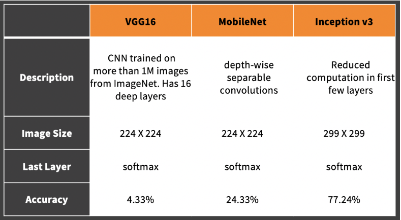

# Dog Breed Fine-Grained Image Identification & Classification
1. This was for Advanced Predictive Modeling Class Project. 
* **Team Members : Jui Gupta, Jess Lee, Clay Mason, Chelsea Matthews, and Cuiting Zhong** 
2. We built image classfication models using VGG16, MobileNet, and Inception V3 

# Dataset
Used famous open data source [Stanford Dog Breed Dataset](http://vision.stanford.edu/aditya86/ImageNetDogs/)

# Performance Comparison among Dog Breed Fine-Grained Image Classification Models
1. Approach details, models and insights are posted on Medium : 
[Dog Breed Fine-Grained Image Classficiation](https://medium.com/@claymason313/dog-breed-image-classification-1ef7dc1b1967)  
 
2. Summary of model performances : 
 

